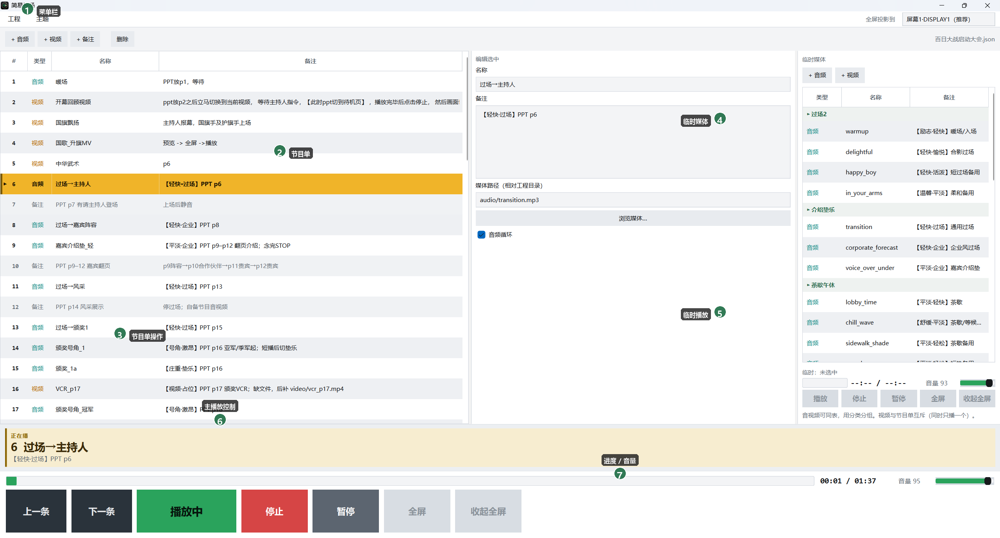
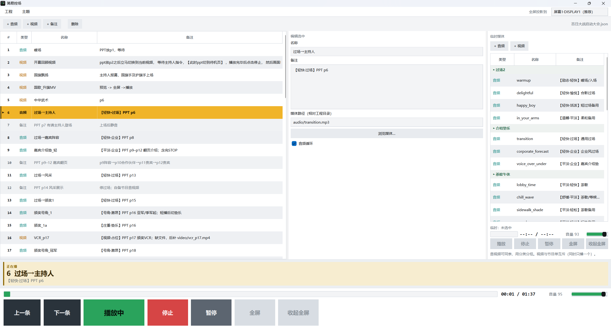
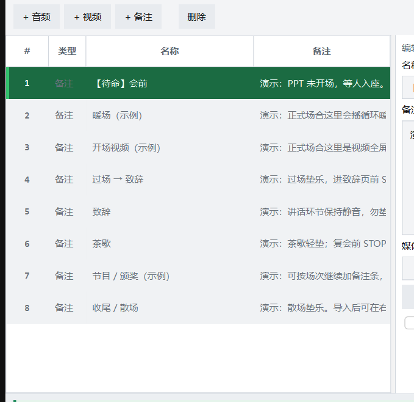
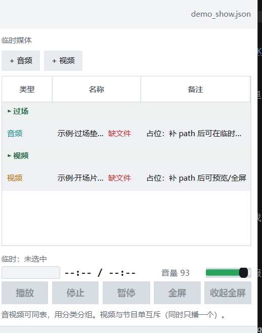

<p align="center">
  
</p>

<h1 align="center">简易控场</h1>

<p align="center">
  <b>Windows 活动 / 年会现场音视频控场软件</b><br>
  节目单编排 · 双屏投影 · 临时配乐叠播 · JSON 工程（可给 AI 生成）
</p>

<p align="center">
  <a href="https://github.com/yikelen/kongchang/releases/latest"></a>
  <a href="LICENSE"></a>
  
  
</p>

<p align="center">
  <a href="https://github.com/yikelen/kongchang/releases/latest"><b>⬇ 下载 Windows 便携版</b></a>
  ·
  <a href="#界面说明">界面说明</a>
  ·
  <a href="#功能特性">功能特性</a>
  ·
  <a href="AGENTS.md">给 AI Agent</a>
  ·
  <a href="examples/demo_show.json">文字演示工程</a>
</p>

---

## 它解决什么问题

现场常见做法是：PPT 在一块屏翻页，音视频另开播放器——容易播错、切错屏、讲话时垫乐盖过人声。

**简易控场**把「节目单 + 播放 + 投影」收成一个 Windows 小工具：

- 操作台在一块屏，视频全屏投到另一块屏
- **不控制 PPT 翻页**（PPT 仍由你自己播）
- 音视频用自带 **mpv** 解码，程序只负责控场逻辑

---

## 界面说明

主窗口分区如下（编号与下图对应）：



| 编号 | 区域 | 作用 |
|:---:|------|------|
| **①** | **菜单栏** | `工程`：新建 / 打开 / 保存；`全屏投影到`：选择观众屏；`帮助`：关于与说明 |
| **②** | **节目单** | 本场演出顺序：音频 / 视频 / 备注；正在播黄色高亮，选中绿色 |
| **③** | **节目单操作** | 添加条目、上移 / 下移、删除；改完约 1.5 秒自动保存 |
| **④** | **临时媒体** | 应急垫乐、过场片；按「分类」分组，与节目单互不干扰 |
| **⑤** | **临时播放** | 临时区独立五键：播放 / 停止 / 暂停 / 全屏 / 收起 + 进度 / 音量 |
| **⑥** | **主播放控制** | 跟节目单：预览 → 播放、停止、暂停、全屏、收起 |
| **⑦** | **进度 / 音量** | 主通道进度条与音量；本机记住音量 |

未标注截图（干净版）：



| 节目单局部 | 临时媒体局部 | 底栏控制 |
|:---:|:---:|:---:|
|  |  |  |

---

## 功能特性

### ① 菜单栏

| 功能 | 说明 |
|------|------|
| 工程 → 新建 / 打开 / 保存 | 一份活动 = 一份 `.json` + 同目录媒体；`Ctrl+S` 立即保存 |
| 全屏投影到 | 下拉列出显示器，会标「本软件 / 推荐」，避免盖住操作台 |
| 帮助 | 版本与简要说明 |

### ②③ 节目单（左侧）

| 功能 | 说明 |
|------|------|
| 三种条目 | **音频** / **视频** / **备注**（备注只作提词，不可播） |
| 拖拽或按钮排序 | 现场可临时调整顺序 |
| 缺文件提示 | 媒体还没拷齐也能先排单，列表标「缺文件」 |
| 正在播高亮 | 播放中黄色，选中绿色，方便对词 |
| 自动保存 | 改单后约 1.5 秒落盘 |

### ⑥⑦ 底栏主播放（跟节目单）

| 功能 | 说明 |
|------|------|
| 预览 → 播放 | 视频先出预监小窗（暂停），确认无误再点播放 |
| 停止 / 暂停 | 停止可渐停；暂停 / 继续 |
| 全屏 / 收起 | 投到菜单所选投影屏；可收回预监 |
| 进度 / 音量 | 可拖进度；音量本机记住 |

主按钮会随选中条目变化：

| 选中状态 | 绿色主按钮 | 含义 |
|----------|------------|------|
| 备注 | 播放（灰） | 不可播 |
| 视频未预监 | **预览** | 小窗暂停，不投屏 |
| 视频已预监 | **播放** | 开播到投影屏 |
| 正在播 | 播放中 | — |
| 已暂停 | 重新播放 | 旁侧「继续」接着播 |

键盘（控场窗 / 预监 / 全屏）：`Space` 暂停 · `←→` 进度 · `↑↓` 音量 · `Esc` 关视频 · `Enter` 全屏

### ④⑤ 临时媒体（右侧，与节目单独立）

| 功能 | 说明 |
|------|------|
| 音视频同表 | 用「分类」分组（如过场、颁奖、视频） |
| 独立五键 + 进度音量 | 不跟底栏抢控制 |
| 音频可叠视频 | 无声片可垫乐；叠播时暂静音视频轨 |
| 视频全局互斥 | 节目单与临时区同时只播一个视频 |
| 选中即接管 | 点列表条目后，临时区按钮控制该条目 |

### 工程与 AI

| 功能 | 说明 |
|------|------|
| JSON 工程 | 一份 `活动名.json` + 相对路径媒体即可带走 |
| 可给 AI 生成 | 字段少、容错；见下方 [工程文件格式](#工程文件格式) 与 [`AGENTS.md`](AGENTS.md) |
| 文字演示 | [`examples/demo_show.json`](examples/demo_show.json) 无需任何 mp3/mp4 |

---

## 安装

### 方式 A：便携包（推荐，免装 Python）

1. 打开 [Releases](https://github.com/yikelen/kongchang/releases/latest)
2. 下载 `kongchang-windows-portable-*.zip` 并解压到本地盘（如 `D:\kongchang`）
3. 双击 **`启动.bat`**

若提示 Qt / DLL 错误，先安装 [VC++ 2015–2022 x64](https://aka.ms/vs/17/release/vc_redist.x64.exe) 再开。

### 方式 B：从源码克隆

仓库不含 `vendor`（约 350MB）。需要本机有 **Python 3.11+** 仅用于首次下载：

```bat
git clone https://github.com/yikelen/kongchang.git
cd kongchang
一键准备运行环境.bat
启动.bat
```

或无人值守（给 Agent）：

```powershell
powershell -ExecutionPolicy Bypass -File scripts\agent_bootstrap.ps1
.\启动.bat
```

---

## 快速体验

1. 启动软件  
2. **工程 → 打开 / 导入…** → 选择 [`examples/demo_show.json`](examples/demo_show.json)  
3. 对照上方 [界面说明](#界面说明) 浏览左侧节目单与右侧临时列表（演示为文字占位，可稍后补媒体）

---

## 现场怎么用（简要）

1. 菜单栏 **①** 选择 **全屏投影到**「推荐」那块屏（不要选标「本软件」的）  
2. 打开本场 `活动.json`  
3. 按节目单 **②** 顺序操作底栏 **⑥**；需要垫乐时用右侧临时音频 **④⑤**  
4. PPT 仍在另一块屏由主持人 / 电脑自己翻页  

---

## 工程文件格式

一份工程 = **一个文件夹 + 一份 json**（文件名可用中文）：

```text
2026年会/
  2026年会.json
  audio/
    warmup.mp3
  video/
    opening.mp4
```

`path` 相对 **json 所在目录**。音视频可暂空 path（列表标「缺文件」）。备注条不要 path。

最小示例：

```json
{
  "version": 1,
  "cues": [
    { "type": "note", "name": "【待命】会前", "notes": "等入场" },
    { "type": "audio", "name": "暖场", "notes": "PPT p1", "path": "audio/warmup.mp3" },
    { "type": "video", "name": "开场片", "notes": "全屏", "path": "video/opening.mp4", "loop": false }
  ]
}
```

更多字段说明、容错规则、给 AI 的提示词模板见下方折叠内容与 [`AGENTS.md`](AGENTS.md)。

<details>
<summary><b>JSON 字段与容错（点击展开）</b></summary>

| 字段 | 必填 | 说明 |
|------|------|------|
| `type` | 是 | `audio` / `video` / `note`（也可用中文） |
| `name` | 建议 | 列表显示名 |
| `notes` | 否 | 现场口令、PPT 页码 |
| `path` | 否 | 相对 json 的媒体路径 |
| `loop` | 否 | 音频默认循环；视频默认否 |
| `category` | 否 | 临时列表分类 |
| `index` / `id` | 否 | 可省略，软件会补 |

音频不写 `loop` → 默认循环；路径反斜杠会转成正斜杠；多写的字段会忽略。

</details>

---

## 给 AI Agent

用户若说「帮我安装并打开这个软件」，请 Agent 阅读并执行：

**[`AGENTS.md`](AGENTS.md)**

其中包含：如何下载 `vendor`、如何启动、如何打开演示、禁止提交的本地文件等。

---

## 技术架构

```text
kongchang/
  启动.bat                 闪屏 + 启动 GUI
  vendor/python/           便携 CPython + PySide6（发行包装有；源码仓用脚本下载）
  vendor/mpv/              便携 mpv
  examples/demo_show.json  文字演示
  src/                     源码（PySide6 UI + mpv IPC）
  AGENTS.md                Agent 安装协议
```

- 工程：`*.json`（跟活动走）  
- 本机设置：`data/settings.json`（投影屏、最近打开等，不进 Git）  
- 播放：进程只发 IPC；解码与窗口由 `mpv.exe` 完成  

---

## 贡献与协议

- Issue / PR 欢迎  
- 请勿提交 `data/settings.json`、真实活动名单、或整个 `vendor/` 进 Git 历史  
- 许可证：[MIT](LICENSE)（可自由使用、修改、商用）  

隐私与忽略清单：[SECURITY.md](SECURITY.md)
